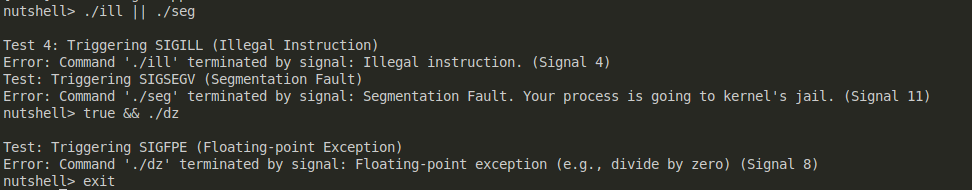
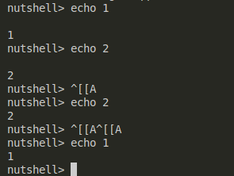

# nutshell 
A compact, minimal Linux shell written in C++

## Features
### Single command execution 
An external command is executable if it is defined in system's `PATH` variable. For example, if you want to run `ls` and the executable is at `/usr/bin/ls`, then `PATH` must contain `/usr/bin`. 

Two built-in commands are supported: 
- `exit` to exit the shell 
- `steve` to list all the suspended jobs 

### Multi-command execution logic
Currently supports up to 2 chaining commands. 
| Symbol | Explanation |
|--------|-------------|
| `\|`    | Pipe: Used to pass the output of one command as input to another command. |
| `\|\|`   | Logical OR: Executes the second command only if the first command fails. |
| `&&`   | Logical AND: Executes the second command only if the first command succeeds. |

### Error message 
If any command exits with an error, an error message is printed to let them know. If there are 2 commands (in the case of pipe, AND, OR), the exact command that causes the problem will be identified. 


### Signal handling 
Two keyboard-triggered signals are supported: 
- Ctrl+C (SIGINT) to terminate foreground process group 
- Ctrl+Z (SIGTSTP) to suspend foreground process group (currently cannot resume suspended process yet)

### Command history 
Past commands are saved in `.nutshell_history` file in the same directory as the shell is spawned. Using arrow key up/down and Enter to run past command: 


### A graphic UI 


## Developer Setup 
### Requirements 
- GCC 14.1.1 
- CMake >= 3.16

If you are running on MacOS then install GCC-14 via brew.

### Recommended 
- The recommended editor is Visual Studio Code

### Build Instructions 
1. Clone the repository && `cd` into it
```bash 
git clone https://github.com/lanphgphm/nutshell.git
cd nutshell 
```
2. Add your code to `src/` directory 
- It is recommended that you put all imports and method signatures into a `class.h` file. The `class.cpp` file is only for implementation. 
- See class template in `src/templates/` (don't add your code under this directory).

3. Compile source code & run app
On Linux:
```bash 
mkdir -p build 
cd build
cmake .. && cmake --build . && ./appnutshell 
```
On MacOS:
```bash
cmake -DCMAKE_C_COMPILER=/usr/local/bin/gcc-14 -DCMAKE_CXX_COMPILER=/usr/local/bin/g++-14 .. && cmake --build . && ./appnutshell
```
## User Installation


